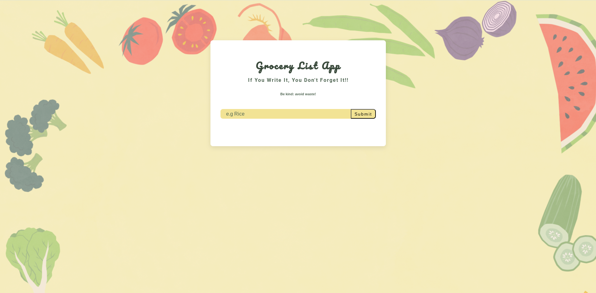

# Grocery List App

## Overview
Created a functional grocery list with JavaScript as requested by ReDi School, as part of the adimission process for the Full-Stack-Bootcamp Spring 2025 Semester. 

### The challenge

Users should be able to:

-	Add grocery items to the list and it should appear
-	Edit the grocery item
-   Remove items
-   Clear list

### Screenshot

### Links

- Solution URL: https://github.com/Lilian-CR/Prework-Full-Stack-Bootcamp_Grocery_List_App
- Live Site URL: https://prework-full-stack-grocery-list.netlify.app/

## Process
-	I watchwed the FreeCodeCamp Youtube tutorial to layout out my html, js and css. 
Set up the JavaScript file, selecting items from the html doc, setting up our variables and creating classes to store the numbers that would be used. 
-  Next was added event listeners and functions for when a button is clicked, such as the rubbish icon, submit button, etc. 
-	Defined the javascript functions as adding items, displaying alerts when the text field is clicked wheil empty, for removing items, functions to edit items, clear items and delete.
-	Added a local storage to keep track of the items as well as to revert to a default state when cleared.
- Added design elements made with canva.com for the background image and new font colours and shadows.

### Coded with:

- HTML
- CSS 
- Javascript
- Responsive mobile & web design

### Resources

- Free Code Camp Youtube tutorial- https://www.youtube.com/watch?v=3PHXvlpOkf4&t=22703s
- Canva.com 
